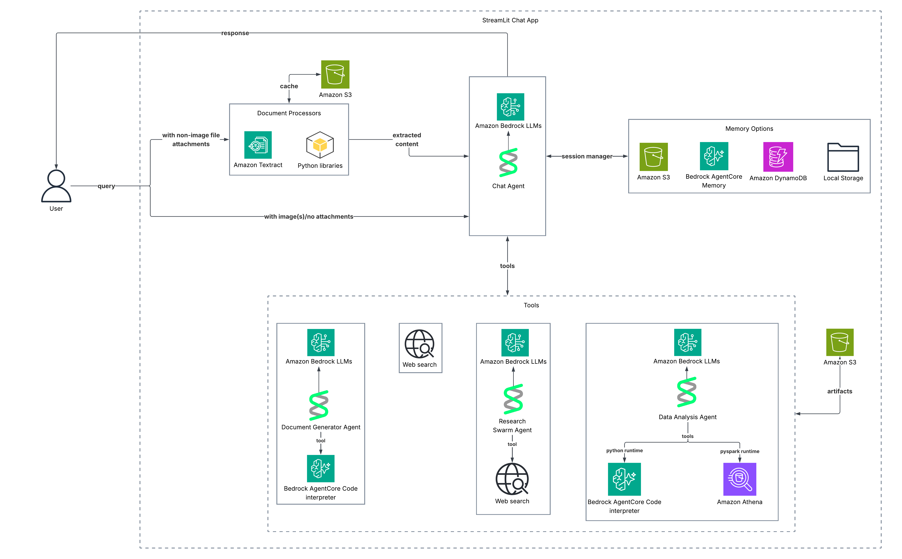
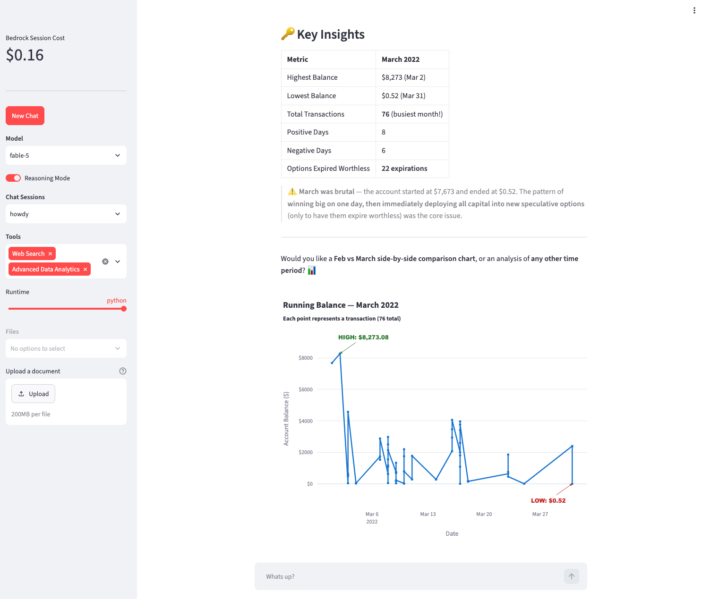
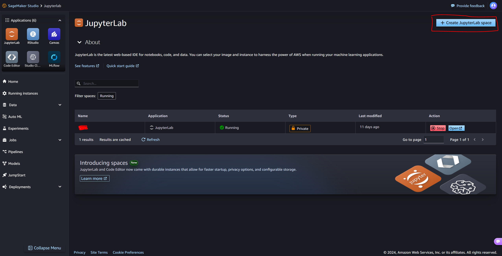
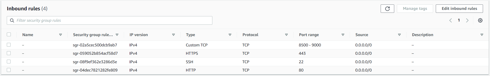
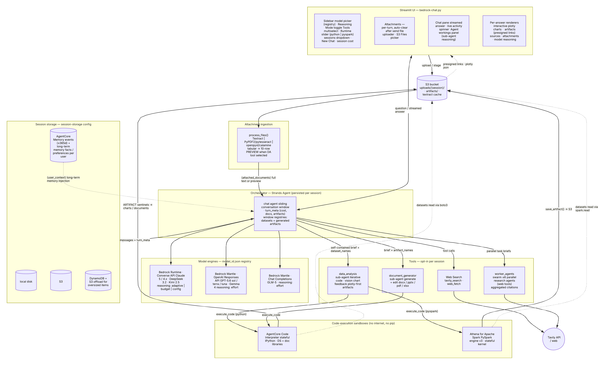

# Bedrock Agentic ChatBot

An agentic Streamlit chatbot for Amazon Bedrock, built on the [Strands Agents](https://strandsagents.com) framework. A persisted orchestrator agent answers conversationally and delegates to specialized sub-agents and tools — sandboxed data analysis, document generation/editing, parallel web-research workers, and web search — with durable sessions and optional cross-session long-term memory via Amazon Bedrock AgentCore Memory.

> **Note:** This sample application is for POC purpose ONLY.



READ THE FOLLOWING **PREREQUISITES** CAREFULLY.

## Features

- **Agentic orchestration**: A Strands `Agent` owns every conversation. Tools are opt-in per session from the sidebar; the orchestrator decides when to invoke them and relays sub-agent results. Live activity is streamed to the chat bubble (tool spinners, per-worker progress, an "Agent workings" panel showing sub-agent reasoning).
- **Broad model catalog, three engines**: Model routing is registry-driven (`model_id.json`). Supports Bedrock **Runtime** models via the Converse API (Anthropic Claude, DeepSeek, Kimi, ...) and Bedrock **Mantle** OpenAI-compatible models via the Responses API (OpenAI GPT, Google Gemma) and Chat Completions API (Zai GLM). Reasoning mode is supported per-model with the correct parameter dialect for each family.
- **Advanced Data Analytics** (sidebar tool): a data-analysis **sub-agent** writes and runs Python against your attached datasets in a sandbox, iterating on errors, validating its own charts (vision feedback), and returning a written analysis with interactive Plotly charts. Two runtimes, selected by a slider:
  - **python** — [Amazon Bedrock AgentCore Code Interpreter](https://docs.aws.amazon.com/bedrock-agentcore/latest/devguide/code-interpreter-tool.html): serverless, stateful IPython kernel with pre-installed data-science libraries.
  - **pyspark** — Amazon Athena for Apache Spark: stateful Spark kernel for larger data (requires a **PySpark engine version 3** workgroup; the newer "Apache Spark 3.5" engine does not support the inline calculation APIs).
- **Document Generator & Editor** (sidebar tool): a sub-agent produces and edits Word/PowerPoint/PDF/Excel files in the Code Interpreter sandbox (python-docx, python-pptx, reportlab, xlsxwriter, ...), verifies them structurally, and delivers them as presigned download links in an **artifacts** expander. Follow-up edits work across app restarts — generated artifacts are re-discoverable from the conversation.
- **Research Workers** (sidebar tool): the orchestrator fans self-contained research briefs out to parallel ephemeral worker agents (each with web search + page fetch), keeping its own context clean. Progress is shown per worker; citations are aggregated into the **Sources** expander.
- **Web Search** (sidebar tool): Tavily search + lightweight page fetch (requests + trafilatura, no headless browser) for the orchestrator itself. Source URLs render under each answer.
- **Per-turn attachments**: Upload documents (PDF, CSV, TXT, PNG, JPG, XLSX, JSON, DOCX, PPTX, py, ...) or pick files from S3. Attachments are sent with your next question only, then auto-cleared from the widgets — follow-ups answer from conversation history, and the data-analysis/doc-generation sub-agents automatically keep access to any dataset still visible in the conversation window.
- **Session storage backends** (`session-storage` config): `local` disk, `S3`, `DynamoDB` (with automatic S3 offload for oversized items), or **Amazon Bedrock AgentCore Memory**. Conversations are persisted and restored across app restarts; the sidebar lists all prior sessions per user.
- **Long-term memory** (AgentCore Memory backend only): the memory resource's strategies extract facts and user preferences from conversations in the background and inject them as context into future sessions — the assistant remembers, e.g., your preferred chart style across chats.
- **Cost tracking**: Per-session Bedrock cost estimated from token counts and `pricing.json`.
- **Document processing**: Amazon Textract (recommended) or local Python libraries (PyPDF2/pytesseract) for PDF and image extraction, with S3 caching of results.

## Architecture

```
Streamlit UI (bedrock-chat.py)
  └─ Orchestrator agent (Strands, persisted per session)
       ├─ tavily_search / web_fetch          [Web Search]
       ├─ data_analysis  ── sub-agent ── execute_code ── AgentCore Code Interpreter
       │                                            └── Athena Spark (PySpark v3)
       ├─ document_generator ── sub-agent ── execute_code ── AgentCore Code Interpreter
       └─ worker_agents ── N parallel single-shot research agents (web tools)

Sessions:  local | S3 | DynamoDB | AgentCore Memory   (agent/sessions.py)
Models:    Bedrock Runtime (Converse) | Bedrock Mantle (OpenAI Responses / Chat Completions)
```

Key modules:
| Path | Purpose |
|---|---|
| `bedrock-chat.py` | Streamlit UI, attachment ingestion, tool wiring, rendering |
| `agent/chat_agent.py` | Orchestrator construction, model registry/routing, streaming callback handlers |
| `agent/sessions.py` | Session backends, display reconstruction, conversation-window dataset/artifact registries |
| `agent/data_analysis.py` | Data-analysis sub-agent + Code Interpreter / Athena Spark session managers |
| `agent/doc_generator.py` | Document generation/editing sub-agent |
| `agent/workers.py` | Parallel research-worker swarm tool |
| `agent/web_tools.py` | Tavily search + page fetch tools |
| `model_id.json` | Model registry: id, engine, inference profile, reasoning dialect, vision/tool support |
| `pricing.json` | Per-model token pricing for cost display |

## Pre-Requisites
1. [Amazon Bedrock model access](https://docs.aws.amazon.com/bedrock/latest/userguide/model-access.html) for the models you enable in `model_id.json`. Bedrock Mantle models (OpenAI/Gemma/GLM) require access to the [OpenAI-compatible endpoints](https://docs.aws.amazon.com/bedrock/latest/userguide/inference-openai.html).
2. An [S3 bucket](https://docs.aws.amazon.com/AmazonS3/latest/userguide/create-bucket-overview.html) for uploaded-document caching, generated artifacts, and Textract output.
3. **For Advanced Data Analytics and/or Document Generator** — an [AgentCore Code Interpreter](https://docs.aws.amazon.com/bedrock-agentcore/latest/devguide/code-interpreter-tool.html): create one (custom interpreters let you set the execution role) and put its id in `config.json` (`code-interpreter-id`). The interpreter's execution role needs read/write access to the configured S3 bucket. It comes with [pre-installed libraries](https://docs.aws.amazon.com/bedrock-agentcore/latest/devguide/code-interpreter-preinstalled-libraries.html) — no image build required.
4. Optional:
   - **Athena Spark runtime for data analytics**: an Amazon Athena Spark workgroup on **PySpark engine version 3** (the "Apache Spark 3.5" engine does not support the inline calculation APIs this app uses). Set an S3 output location on the workgroup and grant its execution role access to the app's S3 bucket. Name goes in `athena-work-group-name`.
   - **Web Search / Research Workers**: a [Tavily](https://tavily.com) API key, set as the `TAVILY_API_KEY` environment variable — copy `.env.example` to `.env` (gitignored, auto-loaded at startup) or export it in your shell. **Never put a real key in `config.json` or commit one.**
   - **DynamoDB session storage**: a DynamoDB table (partition key `UserId`, sort key `SessionId`).
   - **AgentCore Memory session storage + long-term memory**: an [AgentCore Memory resource](https://docs.aws.amazon.com/bedrock-agentcore/latest/devguide/memory.html) — bring your own (creation is out of this app's scope) and put its id in `agentcore-memory-id`. For long-term memory, create it with strategies whose namespaces match `/facts/{actorId}` (semantic), `/preferences/{actorId}` (user preference), and optionally `/summaries/{actorId}/{sessionId}` (summary).
   - **Amazon Textract** for higher-quality PDF/image extraction (else PyPDF2/pytesseract are used; expect latency with pytesseract).

**⚠ IMPORTANT SECURITY NOTE:**

The **Advanced Data Analytics** and **Document Generator** tools execute LLM-generated Python code. Execution happens in isolated, serverless sandboxes (AgentCore Code Interpreter / Athena Spark) — not in the app process — but the sandbox execution roles can reach whatever you grant them:

1. **IAM scoping**: scope the Code Interpreter and Athena workgroup execution roles to only the S3 bucket/prefixes this app uses.
2. **Bucket isolation**: point `Bucket_Name`/`document-upload-cache-s3-path` at a sandbox S3 location, separate from primary data storage. Keep `input_bucket` (read-only file picker) distinct from `Bucket_Name`.
3. **No package installs**: the sandboxes have no internet access and no pip; only pre-installed libraries are available. Package installation on the fly is deliberately not supported.
4. **POC scope**: this application is designed for POC use. Implement authentication and additional controls before any production deployment.

## Configuration (`config.json`)

| Key | Description |
|---|---|
| `Bucket_Name` | **Required.** S3 bucket for document cache, artifacts, Textract output. |
| `region` | AWS region for Bedrock and all services. |
| `UserId` | User id for session listing/attribution (also the AgentCore Memory actor id). |
| `session-storage` | `local` \| `s3` \| `dynamodb` \| `agentcore`. |
| `DynamodbTable` | DynamoDB table name (required for `dynamodb` storage). |
| `agentcore-memory-id` | AgentCore Memory resource id (required for `agentcore` storage). |
| `max-output-token` | Output-token cap for non-reasoning responses. |
| `chat-history-loaded-length` | Conversation turns kept in the model-visible window. |
| `load-doc-in-chat-history` | `true` keeps attached-document content in history for follow-ups. |
| `AmazonTextract` | `true` to use Textract for PDF/image extraction. |
| `AmazonTextract-result-cache` | S3 prefix for Textract result caching. |
| `document-upload-cache-s3-path` | S3 prefix for uploaded-file caching (no trailing slash). |
| `input_bucket` / `input_s3_path` / `input_file_ext` | S3 location and extensions for the sidebar **Files** picker. |
| `csv-delimiter` | Delimiter used when flattening tabular files to text ("\|", "\t", ","). |
| `code-interpreter-id` | AgentCore Code Interpreter id (required for Advanced Data Analytics `python` runtime and Document Generator). |
| `code-interpreter-session-timeout` | Interpreter session timeout, seconds (default 3600). |
| `athena-work-group-name` | Athena Spark (PySpark v3) workgroup (required for the `pyspark` runtime). |
| `data-analysis-model` | Registry model name for the data-analysis and document-generator sub-agents. |
| `worker-agent-model` | Registry model name for research workers. |
| `worker-agent-max-workers` | Max parallel research workers per call (default 6). |
| `reasoning-effort` | Reasoning tier for all models when Reasoning Mode is on: `low` \| `medium` \| `high`. |
| `reasoning-max-tokens` | Output-token budget per tier, e.g. `{"low":15000,"medium":25000,"high":35000}`. |
| `reasoning-budget-tokens` | Thinking budget per tier for fixed-budget models (e.g. Claude Haiku 4.5). |

### Model registry (`model_id.json`)

Each sidebar model maps to a spec:

```json
"sonnet-4.6": {"id": "anthropic.claude-sonnet-4-6", "engine": "runtime", "profile": "us",
                "reasoning": "adaptive", "vision": true, "tools": true}
```

- `engine`: `runtime` (Bedrock Converse) | `mantle-responses` (OpenAI Responses API) | `mantle-chat` (Chat Completions).
- `profile`: inference-profile prefix (`us`, `global`, or empty) for runtime models.
- `reasoning`: parameter dialect — `adaptive` (Claude 4.6+ adaptive thinking), `budget` (fixed thinking budget, e.g. Haiku 4.5), `config` (`reasoning_config`, e.g. DeepSeek/Kimi), `effort` (OpenAI-style).
- `vision` / `tools`: capability flags that gate image input and the tools dropdown.

Add a model by adding a registry entry and its price in `pricing.json` — no code changes.

## To run this Streamlit App on Sagemaker Studio follow the steps below:



If You have a Sagemaker AI Studio Domain already set up, ignore the first item, however, item 2 is required.
* [Set Up SageMaker Studio](https://docs.aws.amazon.com/sagemaker/latest/dg/onboard-quick-start.html)
* SageMaker execution role should have access to interact with [Bedrock](https://docs.aws.amazon.com/bedrock/latest/userguide/api-setup.html), [S3](https://docs.aws.amazon.com/AmazonS3/latest/userguide/access-policy-language-overview.html), [Bedrock AgentCore](https://docs.aws.amazon.com/bedrock-agentcore/latest/devguide/security-iam.html) (Code Interpreter, and Memory if used) and optionally [Textract](https://docs.aws.amazon.com/aws-managed-policy/latest/reference/AmazonTextractFullAccess.html), [DynamoDB](https://docs.aws.amazon.com/amazondynamodb/latest/developerguide/iam-policy-specific-table-indexes.html) and [Amazon Athena](https://docs.aws.amazon.com/athena/latest/ug/managed-policies.html) if these services are used.

### On SageMaker AI Studio JupyterLab:
* [Create a JupyterLab space](https://docs.aws.amazon.com/sagemaker/latest/dg/studio-updated-jl.html)
* 
* Open a terminal by clicking **File** -> **New** -> **Terminal**
* Navigate into the cloned repository directory using the `cd bedrock-claude-chatbot` command and run the following commands to install the application python libraries:
  - sudo apt update
  - sudo apt upgrade -y
  - chmod +x install_package.sh
  - ./install_package.sh
* If you decide to use Python Libs for PDF and image processing, this requires tesserect-ocr. Run the following command:
    - sudo apt update -y
    - sudo apt-get install tesseract-ocr-all -y
* Run command `python3 -m streamlit run bedrock-chat.py --server.enableXsrfProtection false` to start the Streamlit server. Do not use the links generated by the command as they won't work in studio.
* Copy the URL of the SageMaker JupyterLab. It should look something like this https://qukigdtczjsdk.studio.us-east-1.sagemaker.aws/jupyterlab/default/lab/tree/healthlake/app_fhir.py. Replace everything after .../default/ with proxy/8501/, something like https://qukigdtczjsdk.studio.us-east-1.sagemaker.aws/jupyterlab/default/proxy/8501/. Make sure the port number (8501 in this case) matches with the port number printed out when you run the `python3 -m streamlit run bedrock-chat.py --server.enableXsrfProtection false` command; port number is the last 4 digits after the colon in the generated URL.

## To run this Streamlit App on AWS EC2 (I tested this on the Ubuntu Image)
* [Create a new ec2 instance](https://docs.aws.amazon.com/AWSEC2/latest/UserGuide/EC2_GetStarted.html)
* Expose TCP port range 8500-8510 on Inbound connections of the attached Security group to the ec2 instance. TCP port 8501 is needed for Streamlit to work. See image below
* 
* EC2 [instance profile role](https://docs.aws.amazon.com/IAM/latest/UserGuide/id_roles_use_switch-role-ec2_instance-profiles.html) has the required permissions to access the services used by this application mentioned above.
* [Connect to your ec2 instance](https://docs.aws.amazon.com/AWSEC2/latest/UserGuide/AccessingInstances.html)
* Run the appropiate commands to update the ec2 instance (`sudo apt update` and `sudo apt upgrade` -for Ubuntu)
* Clone this git repo `git clone [github_link]` and `cd bedrock-claude-chatbot`
* Install python3 and pip if not already installed, `sudo apt install python3` and `sudo apt install python3-pip`.
* If you decide to use Python Libs for PDF and image processing, this requires tesserect-ocr. Run the following command:
    - If using Centos-OS or Amazon-Linux:
        - sudo rpm -Uvh https://dl.fedoraproject.org/pub/epel/epel-release-latest-7.noarch.rpm
        - sudo yum -y update
        - sudo yum install -y tesseract
    - For Ubuntu or Debian:
        - sudo apt-get install tesseract-ocr-all -y
* Install the dependencies by running the following commands (use `yum` for Centos-OS or Amazon-Linux):
  - sudo apt update
  - sudo apt upgrade -y
  - chmod +x install_package.sh
  - ./install_package.sh
* Run command `tmux new -s mysession` to create a new session. Then in the new session created `cd bedrock-claude-chatbot` into the **ChatBot** dir and run `python3 -m streamlit run bedrock-chat.py` to start the streamlit app. This allows you to run the Streamlit application in the background and keep it running even if you disconnect from the terminal session.
* Copy the **External URL** link generated and paste in a new browser tab.
* **⚠ NOTE:** The generated link is not secure! For [additional guidance](https://github.com/aws-samples/deploy-streamlit-app).
To stop the `tmux` session, in your ec2 terminal Press `Ctrl+b`, then `d` to detach. to kill the session, run `tmux kill-session -t mysession`

## Usage notes

- **Attachments are per-turn**: upload a file (or pick one from **Files**), ask your question, and the widgets clear automatically — the content is now in the conversation history and follow-ups work without re-attaching. The data-analysis and document-generation sub-agents keep S3 access to any dataset whose content is still within the loaded conversation window; if a document ages out of the window, re-attach it.
- **Runtime slider** (shown when Advanced Data Analytics is selected): `python` for general analysis (fast startup, modern libraries), `pyspark` for large data (Athena Spark; first turn waits ~35s for session startup, and note the dated runtime: Python 3.9 / pandas 1.4).
- **Reasoning Mode** (shown for models with a reasoning dialect): toggles extended thinking using the per-model dialect and the configured `reasoning-effort` tier.
- **Charts**: analysis charts are returned as interactive Plotly figures; generated documents appear as presigned links in the **artifacts** expander (links are re-signed on every UI interaction).
- **New Chat** starts a fresh session; prior sessions remain in the dropdown and fully restore on selection — including charts, artifacts, and sources.
- **Session backends can't be mixed**: switching `session-storage` hides sessions stored in other backends (they are not migrated).

## Limitations and Future Updates
1. **Pricing**: Pricing is only calculated for the Bedrock models not including cost of any other AWS service used. The calculation is prompt-cache-aware: when a model reports cache read/write tokens, they are billed at the `cache_read`/`cache_write` rates in `pricing.json` (falling back to the input rate if those keys are missing). Pricing information is stored in the static `pricing.json` file — update it manually to reflect current [Bedrock pricing](https://aws.amazon.com/bedrock/pricing/). Sub-agent (data analysis / docgen / workers) token usage is not yet counted. Treat the displayed cost as a rough estimate.
2. **AgentCore Memory retention**: conversation events on the `agentcore` backend expire per the memory resource's event-expiry setting (7–365 days). Extracted long-term memories survive; raw history does not.
3. **Authentication**: the app has no built-in auth; front it with your own (e.g. Cognito + ALB) before exposing it beyond localhost.

## Detailed App Workflow


