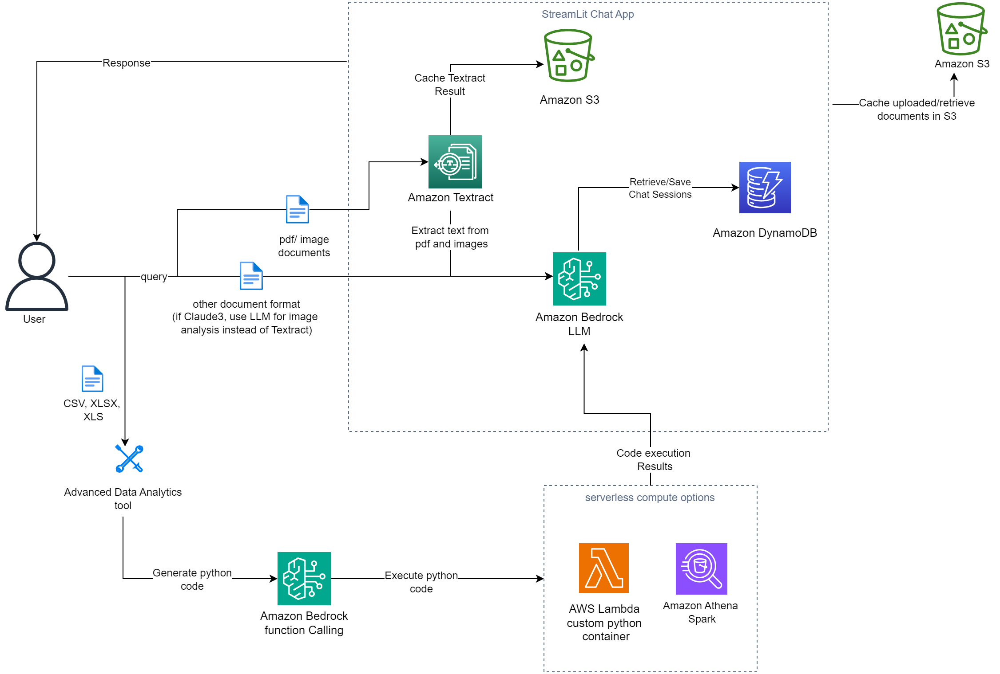

# Bedrock Claude ChatBot
Bedrock Chat App is a Streamlit application that allows users to interact with the Anthropic Bedrock language model. It provides a conversational interface where users can ask questions, upload documents, and receive responses from the AI assistant.




READ THE FOLLOWING **PREREQUISITES** CAREFULLY.

## Features

- **Conversational UI**: The app provides a chat-like interface for seamless interaction with the AI assistant.
- **Document Upload**: Users can upload various types of documents (PDF, CSV, TXT, PNG, JPG, XLSX, JSON, DOCX, Python scripts etc) to provide context for the AI assistant.
- **Caching**: Uploaded documents and extracted text are cached in an S3 bucket for improved performance. This serves as the object storage unit for the application as documents are retrieved and loaded into the model to keep conversation context.
- **Chat History**: The app stores stores and retrieves chat history (including document metadata) to/from a DynamoDB table, allowing users to continue conversations across sessions.
- **Session Store**:  The application utilizes DynamoDB to store and manage user and session information, enabling isolated conversations and state tracking for each user interaction.
- **Model Selection**: Users can select different Anthropic models (Claude-3.5-Sonnet. Claude-3-Sonnet, Claude-3-Haiku, Claude-Instant-V1, Claude-V2, Claude-V2:1) for their queries. It incorporates the Bedrock Converse API providing a standardized model interface.
- **Cost Tracking**: The application calculates and displays the cost associated with each chat session based on the input and output token counts and the pricing model defined in the `pricing.json` file.
- **Logging**: The items logged in the DynamoDB table include the user ID, session ID, messages, timestamps,uploaded documents s3 path, input and output token counts. This helps to isolate user engagement statistics and track the various items being logged, as well as attribute the cost per user.
- **Tool Usage**: **`Advanced Data Analytics tool`** for processing and analyzing structured data (CSV, XLX and XLSX format).
- **Extensible Tool Integration**: This app can be modified to leverage the extensive Domain Specific Language (DSL) knowledge inherent in Large Language Models (LLMs) to implement a wide range of specialized tools. This capability is enhanced by the versatile execution environments provided by Docker containers and AWS Lambda, allowing for dynamic and adaptable implementation of various DSL-based functionalities. This approach enables the system to handle diverse domain-specific tasks efficiently, without the need for hardcoded, specialized modules for each domain.

There are two files of interest.
1. A Jupyter Notebook that walks you through the ChatBot Implementation cell by cell (Advanced Data Analytics only available in the streamlit chatbot).
2. A Streamlit app that can be deployed to create a UI Chatbot.

## Pre-Requisites
1. [Amazon Bedrock Anthropic Claude Model Access](https://docs.aws.amazon.com/bedrock/latest/userguide/model-access.html)
2. [S3 bucket](https://docs.aws.amazon.com/AmazonS3/latest/userguide/create-bucket-overview.html) to store uploaded documents and Textract output.
3. [Amazon Elastic Container Registry](https://docs.aws.amazon.com/AmazonECR/latest/userguide/repository-create.html) to store custom docker images.
4. Optional:
    - Create an Amazon DynamoDB table to store chat history (Run the notebook **BedrockChatUI** to create a DynamoDB Table). This is optional as there is a local disk storage option, however, I would recommend using Amazon DynamoDB.
    - Amazon Textract. This is optional as there is an option to use python libraries [`pypdf2`](https://pypi.org/project/PyPDF2/) and [`pytessesract`](https://pypi.org/project/pytesseract/) for PDF and image processing. However, I would recommend using Amazon Textract for higher quality PDF and image processing. You will experience latency when using `pytesseract`.

To use the **Advanced Analytics Feature**, this additional step is required (ChatBot can still be used without enabling `Advanced Analytics Feature`):

5. [Amazon Lambda](https://docs.aws.amazon.com/lambda/latest/dg/python-image.html#python-image-clients) function with custom python image to execute python code for analytics.
    - Create an private ECR repository by following the link in step 3.
    - On your local machine or any related AWS services including [AWS CloudShell](https://docs.aws.amazon.com/cloudshell/latest/userguide/welcome.html), [Amazon Elastic Compute Cloud](https://aws.amazon.com/ec2/getting-started/), [Amazon Sageamker Studio](https://aws.amazon.com/blogs/machine-learning/accelerate-ml-workflows-with-amazon-sagemaker-studio-local-mode-and-docker-support/) etc. run the following CLI commands:
        - install git and clone this git repo `git clone [github_link]`
        - navigate into the Docker directory `cd Docker`
        - if using local machine, authenticate with your [AWS credentials](https://docs.aws.amazon.com/cli/v1/userguide/cli-chap-authentication.html)
        - install [AWS Command Line Interface (AWS CLI) version 2](https://docs.aws.amazon.com/cli/latest/userguide/getting-started-install.html) if not already installed.
        - Follow the steps in the **Deploying the image** section under **Using an AWS base image for Python** in this [documentation guide](https://docs.aws.amazon.com/lambda/latest/dg/python-image.html#python-image-instructions). Replace the placeholders with the appropiate values. You can skip step `2` if you already created an ECR repository.
        - In step 6, in addition to `AWSLambdaBasicExecutionRole` policy, **ONLY** grant [least priveledged read and write Amazon S3 policies](https://docs.aws.amazon.com/IAM/latest/UserGuide/reference_policies_examples_s3_rw-bucket.html) to the execution role. Scope down the policy to only include the necessary S3 bucket and S3 directory prefix where uploaded files will be stored and read from as configured in the `config.json` file below.
        - In step 7, I recommend creating the Lambda function in a [Amazon Virtual Private Cloud (VPC)](https://docs.aws.amazon.com/lambda/latest/dg/configuration-vpc.html) without [internet access](https://docs.aws.amazon.com/vpc/latest/userguide/vpc-example-private-subnets-nat.html) and attach Amazon S3 and Amazon CloudWatch [gateway](https://docs.aws.amazon.com/vpc/latest/privatelink/vpc-endpoints-s3.html) and [interface endpoints](https://docs.aws.amazon.com/vpc/latest/privatelink/create-interface-endpoint.html#create-interface-endpoint.html) accordingly. The following step 7 command can be modified to include VPC paramters:
        ```
        aws lambda create-function \
            --function-name YourFunctionName \
            --package-type Image \
            --code ImageUri=your-account-id.dkr.ecr.your-region.amazonaws.com/your-repo:tag \
            --role arn:aws:iam::your-account-id:role/YourLambdaExecutionRole \
            --vpc-config SubnetIds=subnet-xxxxxxxx,subnet-yyyyyyyy,SecurityGroupIds=sg-zzzzzzzz \
            --memory-size 512 \
            --timeout 300 \
            --region your-region
        ```

        Modify the placeholders as appropiate. I recommend to keep `timeout` and `memory-size` params conservative as that will affect cost. A good staring point for memory is `512` MB.
        - Ignore step 8.

**⚠ IMPORTANT SECURITY NOTE:**

Enabling the **Advanced Analytics Feature** allows the LLM to generate and execute Python code to analyze your dataset that will automatically be executed in a Lambda function environment. To mitigate potential risks:

1. **VPC Configuration**: 
   - It is recommended to place the Lambda function in an internet-free VPC.
   - Use Amazon S3 and CloudWatch gateway/interface endpoints for necessary access.

2. **IAM Permissions**: 
   - Scope down the Lambda execution role to only Amazon S3 and the required S3 resources. This is in addition to `AWSLambdaBasicExecutionRole` policy.

3. **Library Restrictions**: 
   - Only libraries specified in `Docker/requirements.txt` will be available at runtime.
   - Modify this list carefully based on your needs.

4. **Resource Allocation**: 
   - Adjust Lambda `timeout` and `memory-size` based on data size and analysis complexity.

5. **Production Considerations**: 
   - This application is designed for POC use.
   - Implement additional security measures before deploying to production.

The goal is to limit the potential impact of generated code execution.

## Configuration
The application's behavior can be customized by modifying the `config.json` file. Here are the available options:

- `DynamodbTable`: The name of the DynamoDB table to use for storing chat history. Leave this field empty if you decide to use local storage for chat history.
- `UserId`: The DynamoDB user ID for the application. Leave this field empty if you decide to use local storage for chat history.
- `Bucket_Name`: The name of the S3 bucket used for caching documents and extracted text. This is required.
- `max-output-token`: The maximum number of output tokens allowed for the AI assistant's response.
- `chat-history-loaded-length`: The number of recent chat messages to load from the DynamoDB table or Local storage.
- `bedrock-region`: The AWS region where Amazon Bedrock is enabled.
- `load-doc-in-chat-history`: A boolean flag indicating whether to load documents in the chat history. If `true` all documents would be loaded in chat history as context (provides more context of previous chat history to the AI at the cost of additional price and latency). If `false` only the user query and response would be loaded in the chat history, the AI would have no recollection of any document context from those chat conversations. When setting boolean in JSON use all lower caps.
- `AmazonTextract`: A boolean indicating whether to use Amazon Textract or python libraries for PDF and image processing. Set to `false` if you do not have access to Amazon Textract. When setting boolean in JSON use all lower caps.
- `csv-delimiter`: The delimiter to use when parsing structured content to string. Supported formats are "|", "\t", and ",".
- `document-upload-cache-s3-path`: S3 bucket path to cache uploaded files. Do not include the bucket name, just the prefix without a trailing slash. For example "path/to/files".
- `AmazonTextract-result-cache`: S3 bucket path to cache Amazon Textract result. Do not include the bucket name, just the prefix without a trailing slash. For example "path/to/files".
- `lambda-function`: Name of the Lambda function deploy in the steps above. This is require if using the `Advanced Analytics Tool`
- `input_s3_path`: S3 directory prefix, without the foward and trailing slash, to render the S3 objects in the Chat UI.
- `input_bucket`: S3 bucket name where the files to be rendered on the screen are stored.
- `input_file_ext`: comma-seperated file extension names (without ".") for files in the S3 buckets to be rendered on the screen. By default `xlsx` and `csv` are included.

**⚠ IMPORTANT ADVISORY FOR ADVANCED ANALYTICS FEATURE**

When using the **Advanced Analytics Feature**, take the following precautions:
1. **Sandbox Environment**:
   - Set `Bucket_Name` and `document-upload-cache-s3-path` to point to a separate, isolated "sandbox" S3 location.
   - Grant read and write access as [documented](https://docs.aws.amazon.com/IAM/latest/UserGuide/reference_policies_examples_s3_rw-bucket.html) to this bucket/prefix resource to the lambda execution role.
   - Do NOT use your main storage path for these parameters. This isolation is crucial, to avoid potential file overwrite, as the app will execute LLM-generated code.
2. **Input Data Safety**:
   - `input_s3_path` and `input_bucket` are used for read-only operations and can safely point to your main data storage. The LLM is not aware of this parameters unless explicitly provided by user during chat.
   - Only grant read access to this bucket/prefix resource in the execution role attached to the Lambda function.
   - **IMPORTANT**: Ensure `input_bucket` is different from `Bucket_Name`.

By following these guidelines, you mitigate the potential risk of unintended data modification or loss in your primary storage areas.

## To run this Streamlit App on Sagemaker Studio follow the steps below:


If You have a sagemaker Studio Domain already set up, ignore the first item, however, item 2 is required.
* [Set Up SageMaker Studio](https://docs.aws.amazon.com/sagemaker/latest/dg/onboard-quick-start.html) 
* SageMaker execution role should have access to interact with [Bedrock](https://docs.aws.amazon.com/bedrock/latest/userguide/api-setup.html), [S3](https://docs.aws.amazon.com/AmazonS3/latest/userguide/access-policy-language-overview.html) and optionally [Textract](https://docs.aws.amazon.com/aws-managed-policy/latest/reference/AmazonTextractFullAccess.html) and [DynamoDB](https://docs.aws.amazon.com/amazondynamodb/latest/developerguide/iam-policy-specific-table-indexes.html) and [AWS Lambda](https://docs.aws.amazon.com/lambda/latest/dg/access-control-identity-based.html) if these services are used.

### On Sagemaker Studio Classic
* [Launch SageMaker Studio](https://docs.aws.amazon.com/sagemaker/latest/dg/studio-launch.html)
* [Clone this git repo into studio](https://docs.aws.amazon.com/sagemaker/latest/dg/studio-tasks-git.html)
* Open a system terminal by clicking on **Amazon SageMaker Studio** and then **System Terminal** as shown in the diagram below
* 
* Navigate into the cloned repository directory using the `cd` command and run the command `pip install -r req.txt --upgrade` to install the needed python libraries.
* If you decide to use Python Libs for PDF and image processing, this requires tesserect-ocr. Run the following command:
    - sudo rpm -Uvh https://dl.fedoraproject.org/pub/epel/epel-release-latest-7.noarch.rpm
    - sudo yum -y update
    - sudo yum install -y tesseract
* Run command `python3 -m streamlit run bedrock-chat.py --server.enableXsrfProtection false` to start the Streamlit server. Do not use the links generated by the command as they won't work in studio.
* To enter the Streamlit app, open and run the cell in the **StreamlitLink.ipynb** notebook. This will generate the appropiate link to enter your Streamlit app from SageMaker studio. Click on the link to enter your Streamlit app.
* **⚠ Note:**  If you rerun the Streamlit server it may use a different port. Take not of the port used (port number is the last 4 digit number after the last : (colon)) and modify the `port` variable in the `StreamlitLink.ipynb` notebook to get the correct link.

### On SageMaker Studio JupyterLab:
* [Create a JupyterLab space](https://docs.aws.amazon.com/sagemaker/latest/dg/studio-updated-jl.html)
* 
* Open a terminal by clicking **File** -> **New** -> **Terminal**
* Navigate into the cloned repository directory using the `cd` command and run the command `pip install -r req.txt --upgrade` to install the needed python libraries.
* If you decide to use Python Libs for PDF and image processing, this requires tesserect-ocr. Run the following command:
    - sudo apt update -y
    - sudo apt-get install tesseract-ocr-all -y
* Run command `python3 -m streamlit run bedrock-chat.py --server.enableXsrfProtection false` to start the Streamlit server. Do not use the links generated by the command as they won't work in studio.
* Copy the URL of the SageMaker JupyterLab. It should look something like this https://qukigdtczjsdk.studio.us-east-1.sagemaker.aws/jupyterlab/default/lab/tree/healthlake/app_fhir.py. Replace everything after .../default/ with proxy/8501, something like https://qukigdtczjsdk.studio.us-east-1.sagemaker.aws/jupyterlab/default/proxy/8501. Make sure the port number (8501 in this case) matches with the port number printed out when you run the `python3 -m streamlit run bedrock-chat.py --server.enableXsrfProtection false` command; port number is the last 4 digits after the colon in the generated URL.


## To run this Streamlit App on AWS EC2 (I tested this on the Ubuntu Image)
* [Create a new ec2 instance](https://docs.aws.amazon.com/AWSEC2/latest/UserGuide/EC2_GetStarted.html)
* Expose TCP port range 8500-8510 on Inbound connections of the attached Security group to the ec2 instance. TCP port 8501 is needed for Streamlit to work. See image below
* 
* EC2 [instance profile role](https://docs.aws.amazon.com/IAM/latest/UserGuide/id_roles_use_switch-role-ec2_instance-profiles.html) has the required permissions to access the services used by this application mentioned above.
* [Connect to your ec2 instance](https://docs.aws.amazon.com/AWSEC2/latest/UserGuide/AccessingInstances.html)
* Run the appropiate commands to update the ec2 instance (`sudo apt update` and `sudo apt upgrade` -for Ubuntu)
* Clone this git repo `git clone [github_link]`
* Install python3 and pip if not already installed, `sudo apt install python3` and `sudo apt install python3-pip`.
* If you decide to use Python Libs for PDF and image processing, this requires tesserect-ocr. Run the following command:
    - If using Centos-OS or Amazon-Linux:
        - sudo rpm -Uvh https://dl.fedoraproject.org/pub/epel/epel-release-latest-7.noarch.rpm
        - sudo yum -y update
        - sudo yum install -y tesseract
    - For Ubuntu or Debian:
        - sudo apt-get install tesseract-ocr-all -y
* Install the dependencies by running the command `sudo pip install -r req.txt --upgrade`
* Run command `tmux new -s mysession` to create a new session. Then in the new session created `cd` into the **ChatBot** dir and run `python3 -m streamlit run bedrock-chat.py` to start the streamlit app. This allows you to run the Streamlit application in the background and keep it running even if you disconnect from the terminal session.
* Copy the **External URL** link generated and paste in a new browser tab.
* **⚠ NOTE:** The generated link is not secure! For [additional guidance](https://github.com/aws-samples/deploy-streamlit-app). 
To stop the `tmux` session, in your ec2 terminal Press `Ctrl+b`, then `d` to detach. to kill the session, run `tmux kill-session -t mysession`

## Limitations and Future Updates
1. **Limited Bedrock Model Selection**: The application currently supports a fixed set of Bedrock models, including "claude-3-sonnet", "claude-3-haiku", "claude-instant-v1", "claude-v2:1", and "claude-v2". Allowing users to select from a wider range of Bedrock models would make the application more versatile. Users can modify the `bedrock-chat.py` to add more Amazon Bedrock model ids.

2. **Pricing**: Pricing is only calculated for the Bedrock models not including cost of any other AWS service used. In addition, the pricing information of the models are stored in a static `pricing.json` file. Do manually update the file to refelct current [Bedrock pricing details](https://aws.amazon.com/bedrock/pricing/). Use this cost implementation in this app as a rough estimate of actual cost of interacting with the Bedrock models as actual cost reported in your account may differ.

3. **Storage Encryption**: This application does not implement storing and reading files to and from S3 and/or DynamoDB using KMS keys for data at rest encryption.

4. **Production-Ready**: For an enterprise and production-ready chatbot application architecture pattern, check out [Generative AI Application Builder on AWS](https://aws.amazon.com/solutions/implementations/generative-ai-application-builder-on-aws/) and [Bedrock-Claude-Chat](https://github.com/aws-samples/bedrock-claude-chat) for best practices and recommendations.

5. **Tools Suite**: This application only includes a single tool. However, with the many niche applications of LLM's, a library of tools will make this application robust.

## Application Workflow Diagram


**Guidelines**
- When a document is uploaded (and for everytime it stays uploaded), its content is attached to the user's query, and the chatbot's responses are grounded in the document ( a sperate prompt template is used). That chat conversation is tagged with the document name as metadata to be used in the chat history.
- If the document is detached, the chat history will only contain the user's queries and the chatbot's responses, unless the `load-doc-in-chat-history` configuration parameter is enabled, in which case the document content will be retained in the chat history.
- You can refer to documents by their names of format (PDF, WORD, IMAGE etc) when having a conversation with the AI.
- The `chat-history-loaded-length` setting determines how many previous conversations the LLM will be aware of, including any attached documents (if the `load-doc-in-chat-history` option is enabled). A higher value for this setting means that the LLM will have access to more historical context, but it may also increase the cost and potentially introduce latency, as more tokens will be inputted into the LLM. For optimal performance and cost-effectiveness, it's recommended to set the 'chat-history-loaded-length' to a value between 5 and 10. This range strikes a balance between providing the LLM with sufficient historical context while minimizing the input payload size and associated costs.
- ⚠️ When using the Streamlit app, any uploaded document will be persisted for the current chat conversation. This means that subsequent questions, as well as chat histories (if the 'load-doc-in-chat-history' option is enabled), will have the document(s) as context, and the responses will be grounded in that document(s). However, this can increase the cost and latency, as the input payload will be larger due to the loaded document(s) in every chat turn. Therefore if you have the `load-doc-in-chat-history` option enabled, after your first question response with the uploaded document(s), it is recommended to remove the document(s) by clicking the **X** sign next to the uploaded file(s). The document(s) will be saved in the chat history, and you can ask follow-up questions about it, as the LLM will have knowledge of the document(s) from the chat history. On the other hand, if the `load-doc-in-chat-history` option is disabled, and you want to keep asking follow-up questions about the document(s), leave the document(s) uploaded until you are done. This way, only the current chat turn will have the document(s) loaded, and not the entire chat history. The choice between enabling `load-doc-in-chat-history` or not is dependent on cost and latency. I would recommend enabling for a smoother experience following the aforementioned guidelines.
